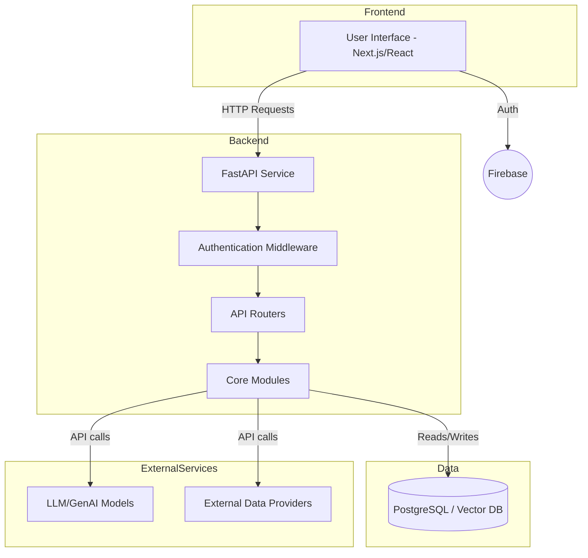

# Architecture Diagram

```mermaid
graph TD
    subgraph Frontend
        UI[User Interface - Next.js/React]
    end
    subgraph Backend
        API[FastAPI Service]
        Auth[Authentication Middleware]
        Routes[API Routers]
        Modules[Core Modules]
    end
    UI -->|HTTP Requests| API
    API --> Auth
    Auth --> Routes
    Routes --> Modules
    subgraph Data
        DB[(PostgreSQL / Vector DB)]
    end
    Modules -->|Reads/Writes| DB
    UI -->|Auth| Firebase((Firebase))
    subgraph ExternalServices
        LLM[LLM/GenAI Models]
        ExtAPI[External Data Providers]
    end
    Modules -->|API calls| LLM
    Modules -->|API calls| ExtAPI
```
